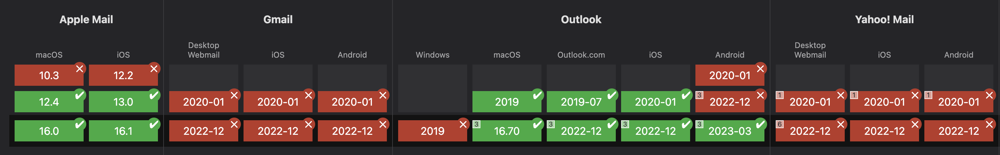

## Differences between dark mode on websites vs email
On a website, only light mode is supported by default. Dark mode is something developers opt into in [one of two ways](https://web.dev/color-scheme/#the-color-scheme-meta-tag):

#### 1. The CSS `color-scheme` property

```css
:root {
  color-scheme: light dark;
}
```

#### 2. A HTML `<meta>` tag in the `<head>` of the page
```html
<meta name="color-scheme" content="light dark">
```

Both these approaches achieve the same end result - the default colors will change depending on the users settings. In light mode the default text color will be black and then default background-color will be white. In dark mode, the text color will be white and the background will be black. However, any colors you explicitly set with CSS will remain unchanged. 

Alternatively, we could set the CSS property or meta tag to `dark` so the default colors will be white text on a black background regardless of user preferences.

```css
:root {
  color-scheme: dark;
}
```

## Dark mode in email
The one big difference between dark mode on a website and in email is that almost all email clients act as if `color-scheme: light dark` or `<meta name="color-scheme" content="light dark">` were set. Not only that, but its impossible to opt out of dark mode in the majority of clients because the `color-scheme` CSS property and meta tag are not widely supported. 

You can keep the default colors as light mode only in the meta tag doesn't work:
```html
<meta name="color-scheme" content="light">
```

Specifying light mode only using the CSS `color-scheme` property is only supported in Apple Mail:
```css
color-scheme: light;
```
Dark mode is imposed on you but you have little control over what your email will actually look like in dark mode because some popular email clients (Gmail, Yahoo) do not support the `prefers-color-scheme` media query. 

:::danger[Gmail]
Gmail is a special case. It will implement dark mode automatically by altering background-colors and text colors that you've set in CSS, often leading to ugly color combinations and unreadable color-contrast. Dark mode is imposed on your email but you have no control over the colors that are used because the `prefers-color-scheme` media query is not supported. The `color-scheme` meta tag and CSS property are not supported. 
:::

## The `prefers-color-scheme` media query
So far we've talked about default colors, but you might also want to specify you're own chosen `background-color` or text colors for dark mode.




### Outlook
- The theme switcher in the Outlook app does not trigger the media query! ...

:::caution[Test your emails in dark mode]
Be sure to test your emails in dark mode, particularly in Gmail, as issues with color contrast are common. 
:::