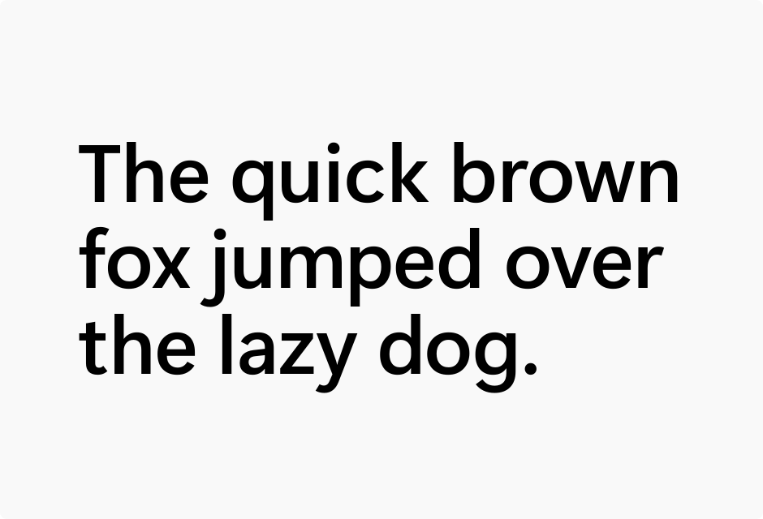
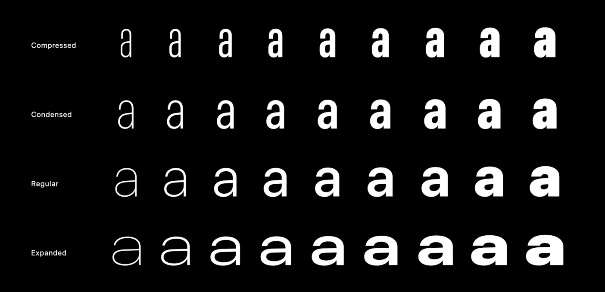
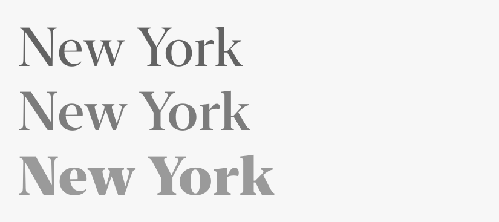
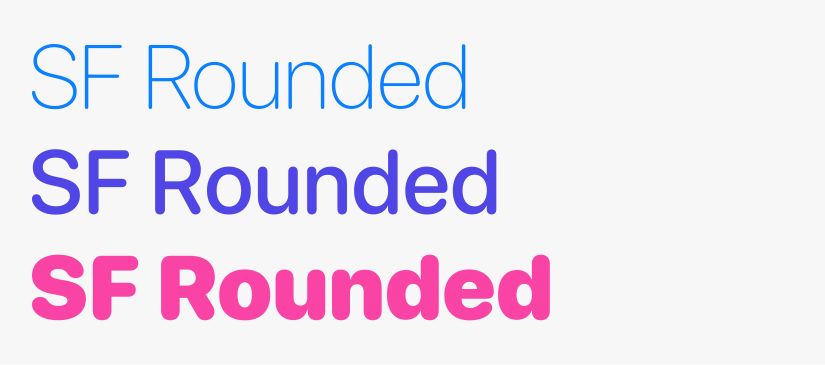
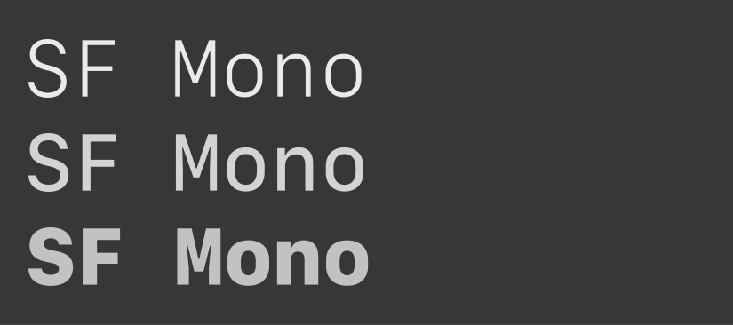

## Custom fonts

:::note[woff2]
Just like on a website, `.woff2` is the best font format for email and nowadays is the only format you need. Avoid using `.woff`, `.ttf` or `.otf` files in an email.
:::

With `@font-face` supported in so few email clients, which other fonts can we use as a fallback? 

## "Web safe fonts"
A web-safe font is one that’s preinstalled on all the major operating systems. As Rémi Parmentier [points out](https://www.hteumeuleu.com/2020/fonts-in-emails/), there are no truly web safe fonts as even Arial and Times New Roman, the most ubiquitous fonts, are absent from Android.

A full list of fonts preinstalled on each operating system can be found at the following links:
- [macOS and iOS](https://developer.apple.com/fonts/system-fonts/)
- [Windows 11](https://learn.microsoft.com/en-us/typography/fonts/windows_11_font_list)

Android devices offer a far more limited range of options. There is no up-to-date list of fonts found on Android devices, and it may vary depending on the device manufacturer(e.g. Samsung, Xiaomi, Google etc). By providing a font-stack ...

## system-ui

```html
<div style="font-family: system-ui;">
```

The `system-ui` CSS keyword refers to the font used by the operating system for its own user interface. Its different for every different OS. They're well designed and look better than most of what you’ll find on Google Fonts.

It’s still relatively common to see a giant font stack aimed at selecting the system font of each different platform: 

```css
font-family: -apple-system, BlinkMacSystemFont, "Segoe UI", Roboto, sans-serif;
```

The CSS keyword `system-ui` as a value for font-family has been supported by all email clients for some time, so the above code is no longer necessary. 

Additionally, Safari also supports the keywords `ui-monospace`, `ui-rounded`, `ui-sans-serif`, and `ui-serif`. In the words of the [CSS Font Spec](https://drafts.csswg.org/css-fonts-4/#ui-sans-serif-def), system fonts “allow web content to integrate with the look and feel of the native OS”. 

Which typefaces do these keywords select on the different operating systems? Let’s take a look. 

### Windows

Windows uses Segoe UI as its system font. Windows 11 added [Segoe UI Variable](https://learn.microsoft.com/en-us/windows/apps/design/signature-experiences/typography), a variable version of the typeface, but sadly this version is not used when you specify the `system-ui` keyword. According to this [blog post](https://tigeroakes.com/posts/segoe-ui-variable/) by a Microsoft employee, it is possible to access the variable version by explicitly specifying the name of the font. e.g:

```css
font-family: 'Segoe UI Variable Display', system-ui;
```




You can download Segoe UI and Segoe Ui Variable from Windows [here](https://learn.microsoft.com/en-us/windows/apps/design/downloads/#fonts). 

No browser on Windows supports `ui-monospace`, `ui-rounded`, `ui-sans-serif` or `ui-serif`.

### Android

The open-source font Roboto is used on Android phones. [Roboto Flex,](https://material.io/blog/roboto-flex) a variable update of the typeface, was released in 2022. 

<iframe style="width:100%; aspect-ratio: 16 / 9; height: auto;" width="560" height="315" src="https://www.youtube.com/embed/f3IQSmKFokU" title="YouTube video player" frameborder="0" allow="accelerometer; autoplay; clipboard-write; encrypted-media; gyroscope; picture-in-picture; web-share" allowfullscreen></iframe>

Unfortunately, Roboto Flex is not used when you specify the `system-ui` keyword, but it will be in an [upcoming version of Android](https://issuetracker.google.com/issues/275398350). 

Roboto can be downloaded from Google Fonts [here](https://fonts.google.com/specimen/Roboto+Flex). 

No browser on Android supports `ui-monospace`, `ui-rounded`, `ui-sans-serif` or `ui-serif`.

### macOS, iOS, iPadOS

Most email clients on Apple devices also support the keywords `ui-monospace`, `ui-rounded`, `ui-sans-serif`, and `ui-serif`. All of the fonts selected by these keywords are variable fonts. 

#### system-ui and `ui-sans-serif` 

`ui-sans-serif` and `system-ui` both select the same font: SF Pro. SF Pro is one particular variant of a typeface called San Francisco. SF Pro has a weight axis, a width axis and a optical size axis, offering a huge amount of typographic versatility.

```css
font-family: ui-sans-serif, system-ui;
font-stretch: 150%;
font-weight: 100;
```



There’s also a grade axis which can be adjusted using the `font-variation-settings` CSS property:
`font-variation-settings: "GRAD" 400;`
Grade is similar to weight. Increasing the weight of a font makes the text wider. Increasing the grade makes the letters thicker without changing the width of the text. 

#### `ui-serif`

`ui-serif` maps to New York. New York offers a weight axis, an optical size axis and a grade axis. 



#### `ui-rounded`

`ui-rounded` maps to SF Rounded. It has a grade and a weight axis.



#### `ui-monospace`

`ui-monospace` maps to SF Mono. This is generally used for displaying code. It has a weight axis and a `YAXS` axis. `YAXS` makes the font vertically thicker. The `YAXS` axis can be adjusted using the `font-variation-settings` CSS property.



The whole point of system fonts is that they’re already on the users operating system, but if you need to download any of these typefaces to use in design software like Figma, they’re available from Apple [here](https://developer.apple.com/fonts/).

If you’re viewing this page using Safari, you can view all the above typefaces [here](https://codepen.io/cssgrid/pen/wvQdxgW). 

:::note[Legal considerations of system fonts]
While Roboto is open-source and can be freely used for anything on any platform, that isn’t the case for Segoe UI or any of the Apple fonts mentioned above. You can make use of them by using the CSS keywords but you can't download them to use in a `@font-face` declaration. The free downloads of these fonts that Apple and Microsoft provide are only for the purpose of creating design mock-ups. 
:::

The obvious drawback of system fonts is that your website will look different on every operating system. The font-size, letter-spacing, width and weight you carefully select on one platform may not look ideal when another font is used on a different platform. When working with email, variation between clients is inevitable whatever approach you take. You can make use of ultra-condensed and expanded versions of SF Pro, for example, and it'll look great on Apple devices, but there's currently no way to recreate that look with Segoe.

## Email client fonts

Email web clients and native applications often embed their own fonts. Gmail uses Google Sans. Outlook.com embeds Segoe UI. You can utilise these as part of your font-stack. 

```html
<div style="font-family: Google Sans, system-ui;">
```